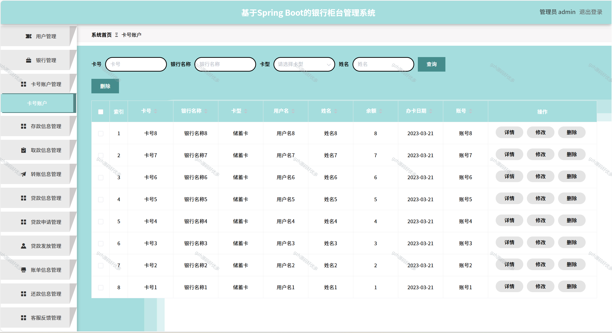
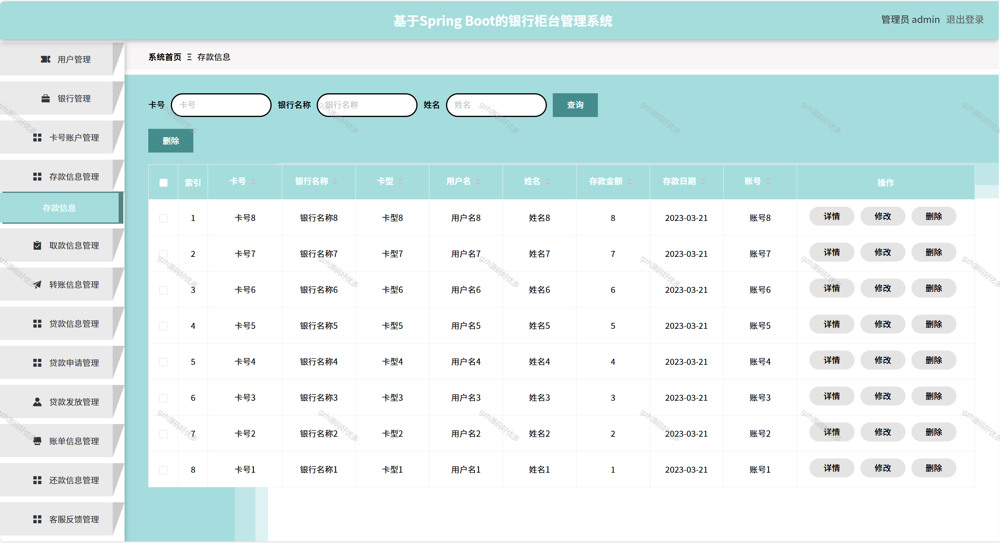
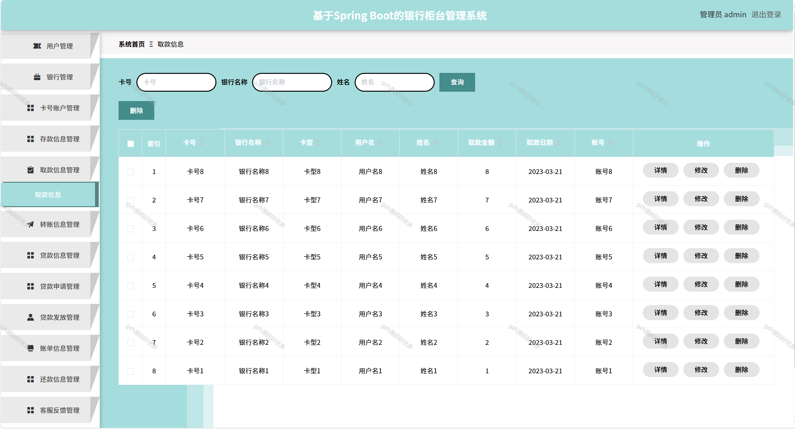
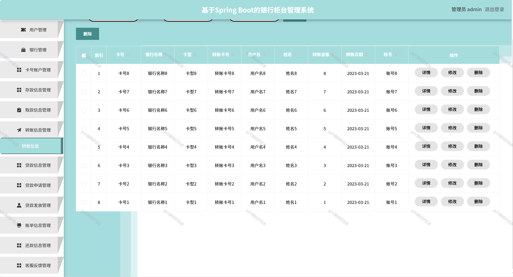
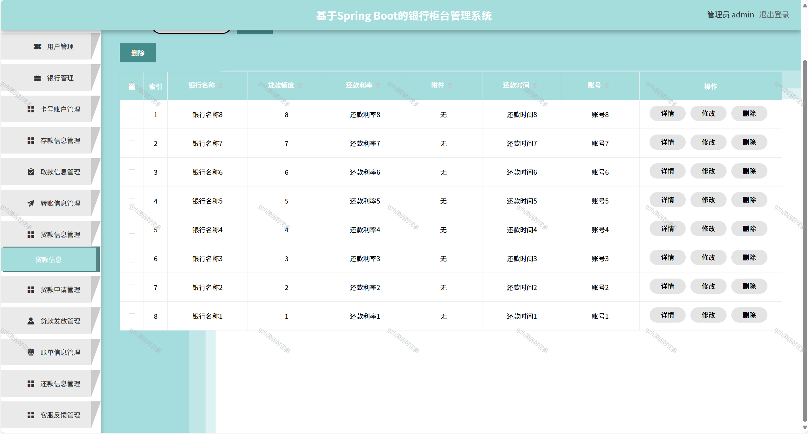
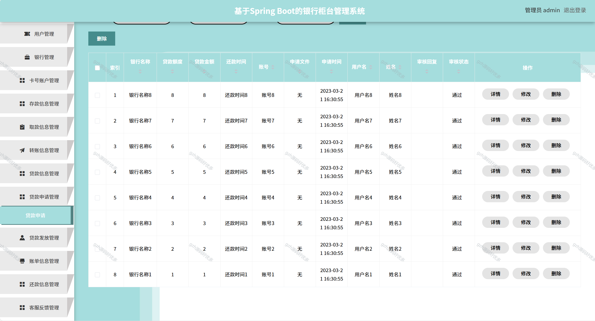
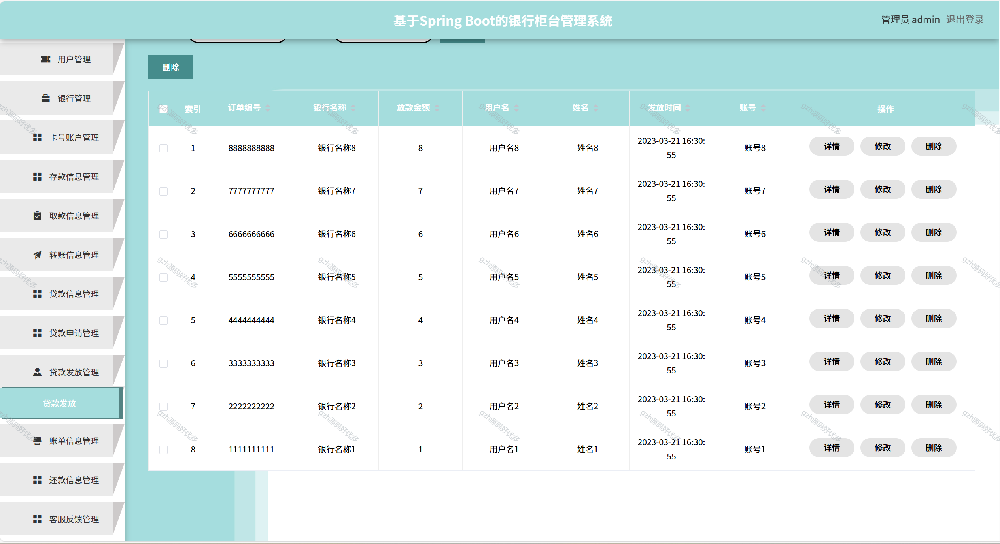
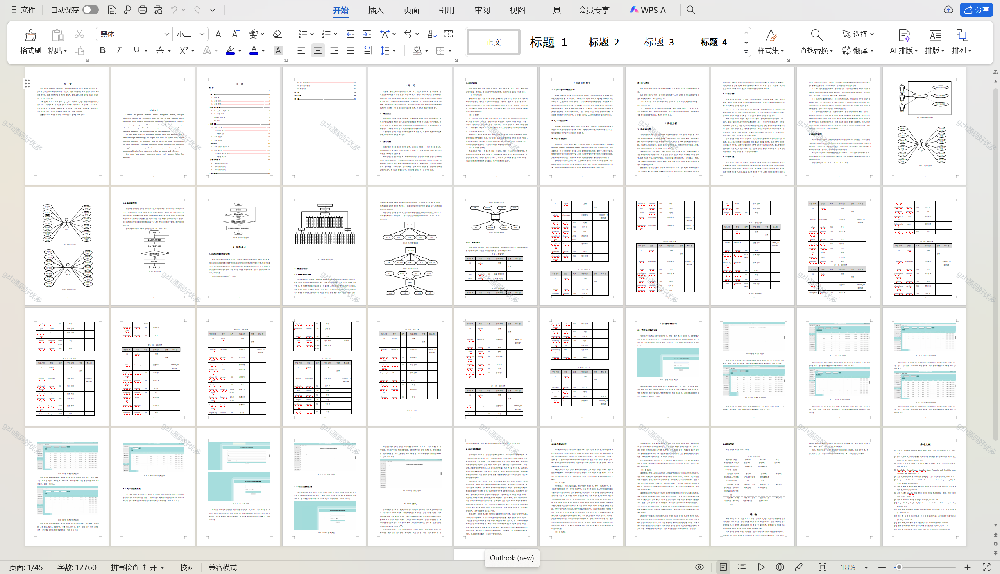

# springbootA335
springbootA335银行柜台管理系统+LW+PPT
 
## 查看主页获取源码 

### 一、关键词

银行前台管理系统，银行柜台业务管理系统，银行柜面管理系统

### 二、作品包含

源码+数据库+万字设计文档+PPT+全套环境和工具资源+本地部署教程

### 三、项目技术

前端技术：Html、Css、Js、Vue2.0、Element-ui 
后端技术：Java、SpringBoot2.0、MyBatis

  
### 四、运行环境（以下版本亲测，其他版本未知，请自测）

开发工具：IDEA/eclipse  + VSCODE

数据库：MySQL5.7（最低要5.7版本）

数据库管理工具：Navicat10以上版本

环境配置软件： JDK1.8 + Maven3.6.3

前端Nodejs：14

浏览器：谷歌浏览器

### 五、项目介绍

项目编号：springbootA335

相比于以前的传统手工管理方式，智能化的管理方式可以大幅降低银行的运营人员成本，实现了银行柜台的标准化、制度化、程序化的管理，有效地防止了银行柜台的随意管理，提高了信息的处理速度和精确度，能够及时、准确地查询和修正通知信息、卡号账户等信息。
课题主要采用JAVA开发语言、Spring Boot框架和MySQL数据库开发技术以及基于Eclipse的编辑器。系统主要包括通知信息、用户信息、银行信息、卡号账户、存款信息管理、取款信息、转账信息、贷款信息、贷款申请、贷款发放、账单信息、还款信息等功能，从而实现智能化的管理方式，提高工作效率

### 六、运行截图

